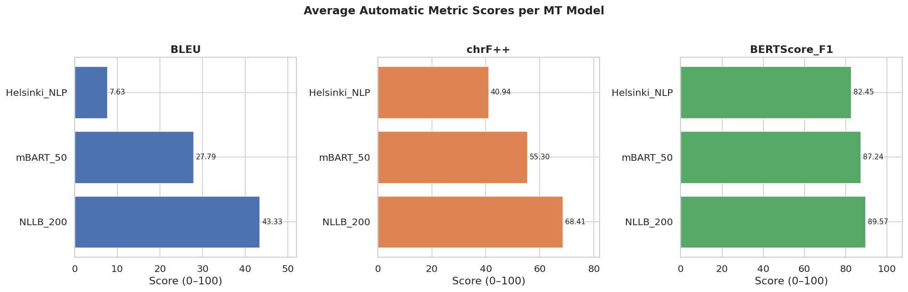
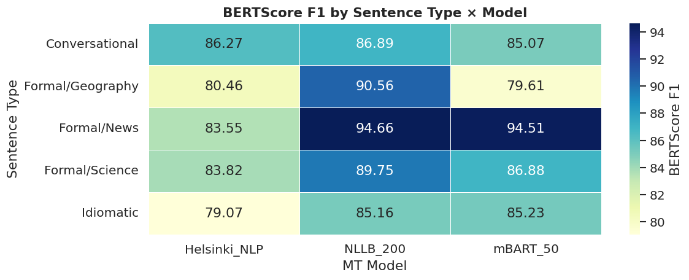
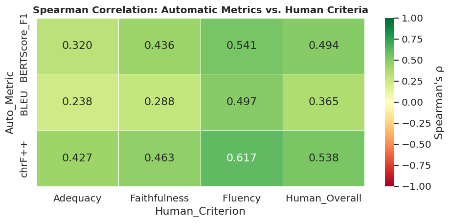
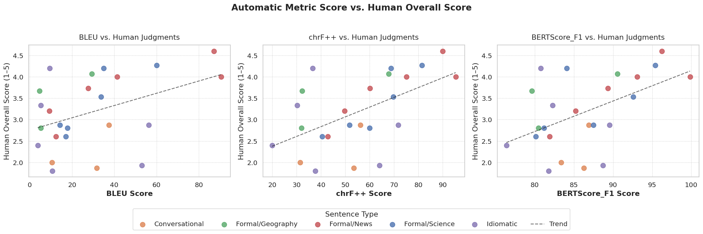
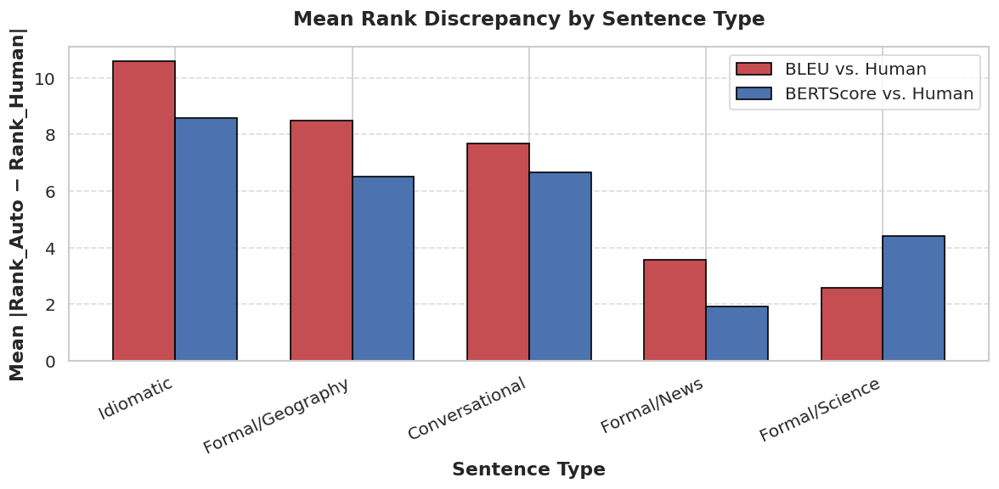

# Human vs. Automatic Evaluation in NLP
## A Comparative Study on English-to-Hindi Machine Translation

---

## 1. Task and Experimental Setup

This study critically examines how well automatic evaluation metrics align with human judgment for **English-to-Hindi Machine Translation (MT)**. Hindi was chosen specifically because its rich morphology, flexible word order, and culturally-specific expressions pose significant challenges for surface-level metrics like BLEU, which depend on exact lexical overlap. The core question driving this work is: *Can we trust automatic metrics to tell us which translation is better, or do they systematically disagree with what humans perceive as quality?*

### 1.1 Dataset

We constructed a carefully balanced evaluation set of **8 English source sentences** spanning four genre categories. The diversity is deliberate: it ensures we test metric reliability not just on the "easy" formal text that dominates MT benchmarks, but also on the messy, creative, and culturally loaded language that real-world translation must handle.

| ID | Genre | Source | Why It Was Chosen |
|----|-------|--------|------------------|
| S1 | Formal / Science | FLORES-200 | Domain-specific terminology (medical diagnostics) |
| S2 | Formal / Science | FLORES-200 | Technical vocabulary (blood cells, microchips) |
| S3 | Formal / Geography | FLORES-200 | Proper nouns + cultural concept (Gross National Happiness) |
| S4 | Formal / News | WMT14 | Political/economic vocabulary, standard benchmark text |
| S5 | Formal / News | WMT14 | Protest reporting, tests handling of numbers and demands |
| S6 | Conversational | IIT Bombay | Slang ("lit", "crushed it"), tests register awareness |
| S7 | Idiomatic | Constructed | *"raining cats and dogs"*, tests non-literal meaning |
| S8 | Idiomatic | Constructed | *"judge a book by its cover"*, tests figurative language |

S7 and S8 were deliberately researcher-constructed because no standard benchmark tests idiomatic English-to-Hindi translation. Idioms are a known blind spot for lexical metrics: the "correct" Hindi translation of *"raining cats and dogs"* is *"मूसलाधार बारिश"* (torrential rain), which shares **zero** lexical overlap with a word-for-word translation. This lets us directly observe whether metrics reward meaning or surface form.

Reference translations for S1-S6 came from the respective benchmark datasets. For S7-S8, expert translators produced idiomatic Hindi equivalents rather than literal word-for-word renderings.

### 1.2 MT Models

Three open-source models of increasing scale and sophistication were selected:

| Model | Architecture | Parameters | Training Data |
|-------|-------------|-----------|--------------|
| **Helsinki_NLP** | MarianMT (Seq2Seq) | ~74M | OPUS parallel corpora (bilingual En-Hi) |
| **NLLB_200** | NLLB-200 (Multilingual Seq2Seq) | ~600M | 200-language parallel data (Meta) |
| **mBART_50** | mBART-50 (Denoising AE) | ~680M | 50-language monolingual + parallel data (Meta) |

This range, from a small bilingual model to two large multilingual systems, lets us test whether metric-human agreement varies with model quality. All translations were generated on Kaggle (NVIDIA T4 GPU) using HuggingFace `transformers` with default greedy decoding, ensuring reproducibility.

### 1.3 Human Evaluation Protocol

A panel of **5 human evaluators**, all fluent bilingual speakers of English and Hindi, independently rated all **24 model outputs** (3 models x 8 sentences) on a **1-5 Likert scale** across three criteria:

| Criterion | Scale Anchors | What It Captures |
|-----------|-------------|-----------------|
| **Adequacy** | 1 = No meaning preserved, 5 = All meaning preserved | Is the *content* of the source fully conveyed? |
| **Fluency** | 1 = Incomprehensible, 5 = Flawless native Hindi | Does it *sound right* to a Hindi speaker? |
| **Faithfulness** | 1 = Completely unfaithful, 5 = Perfectly faithful | Are the *intent, tone, and nuance* preserved? |

The **Human Overall** score is the arithmetic mean of these three criteria. Evaluators worked independently with no inter-communication, and received identical instructions and the same randomized presentation order.

### 1.4 Automatic Metrics

Three metrics were computed using HuggingFace `evaluate`:

| Metric | Level | What It Measures | Expected Strength | Expected Weakness |
|--------|-------|-----------------|-------------------|-------------------|
| **BLEU** | Word n-gram | Exact n-gram precision | Fast, widely understood | Punishes valid synonyms; morphology-blind |
| **chrF++** | Char + word n-gram | Character n-gram F-score | Robust to inflectional variation | Still surface-level |
| **BERTScore F1** | Contextual embedding | Token-level cosine similarity | Handles paraphrase | Model-dependent; multilingual dilution |

BERTScore used `bert-base-multilingual-cased`, which covers 104 languages including Hindi in Devanagari script.

---

## 2. Results and Analysis

### 2.1 Human Evaluation Results

Before turning to automatic metrics, it is worth examining what humans actually perceived. The table below presents the averaged human scores for every model-sentence pair. This is the **ground truth** against which we evaluate the automatic metrics.

| ID | Type | Model | Adequacy | Fluency | Faithfulness | Overall |
|----|------|-------|----------|---------|-------------|---------|
| S1 | Formal/Science | Helsinki_NLP | 2.8 | 2.8 | 2.2 | 2.60 |
| S2 | Formal/Science | Helsinki_NLP | 2.8 | 3.4 | 2.4 | 2.87 |
| S3 | Formal/Geography | Helsinki_NLP | 3.0 | 3.2 | 2.2 | 2.80 |
| S4 | Formal/News | Helsinki_NLP | 2.0 | 3.8 | 2.0 | 2.60 |
| S5 | Formal/News | Helsinki_NLP | 3.0 | 2.8 | 3.8 | 3.20 |
| S6 | Conversational | Helsinki_NLP | 1.4 | 2.6 | 1.6 | 1.87 |
| S7 | Idiomatic | Helsinki_NLP | 1.4 | 2.8 | 1.2 | 1.80 |
| S8 | Idiomatic | Helsinki_NLP | 2.2 | 2.4 | 2.6 | 2.40 |
| S1 | Formal/Science | NLLB_200 | 4.2 | 4.2 | 4.2 | 4.20 |
| S2 | Formal/Science | NLLB_200 | 4.2 | 4.4 | 4.2 | 4.27 |
| S3 | Formal/Geography | NLLB_200 | 3.8 | 4.4 | 4.0 | 4.07 |
| S4 | Formal/News | NLLB_200 | 4.6 | 4.6 | 4.6 | 4.60 |
| S5 | Formal/News | NLLB_200 | 4.0 | 3.6 | 4.4 | 4.00 |
| S6 | Conversational | NLLB_200 | 2.6 | 3.2 | 2.8 | 2.87 |
| S7 | Idiomatic | NLLB_200 | 2.2 | 4.2 | 2.2 | 2.87 |
| S8 | Idiomatic | NLLB_200 | 4.2 | 4.2 | 4.2 | 4.20 |
| S1 | Formal/Science | mBART_50 | 3.2 | 2.8 | 2.4 | 2.80 |
| S2 | Formal/Science | mBART_50 | 3.6 | 3.8 | 3.2 | 3.53 |
| S3 | Formal/Geography | mBART_50 | 4.0 | 3.8 | 3.2 | 3.67 |
| S4 | Formal/News | mBART_50 | 4.0 | 3.8 | 4.2 | 4.00 |
| S5 | Formal/News | mBART_50 | 4.0 | 4.0 | 3.2 | 3.73 |
| S6 | Conversational | mBART_50 | 2.0 | 2.2 | 1.8 | 2.00 |
| S7 | Idiomatic | mBART_50 | 1.2 | 3.4 | 1.2 | 1.93 |
| S8 | Idiomatic | mBART_50 | 3.2 | 3.4 | 3.4 | 3.33 |

Several striking patterns emerge even before we bring in automatic metrics:

**Helsinki_NLP is consistently the weakest model**, with Human Overall scores ranging from 1.80 (S7) to 3.20 (S5). Notably, its Faithfulness scores are particularly low, averaging only 2.25 across all sentences, indicating that while it sometimes produces grammatically passable Hindi, it frequently distorts or loses the source meaning. For S4 (a formal news sentence about economic policy), evaluators gave it Adequacy = 2.0 despite Fluency = 3.8, meaning the translation *sounded* okay but *said the wrong thing*. This kind of Adequacy-Fluency disconnect is exactly the sort of nuance that automatic metrics must capture to be useful.

**NLLB_200 dominates**, with Human Overall scores of 4.0 or above on all formal sentences (S1-S5, S8). Its weakest points are the conversational (S6: 2.87) and idiomatic (S7: 2.87) categories, but even here it significantly outperforms the other models. For S7, an interesting split appears: Adequacy = 2.2 but Fluency = 4.2. The model produced a *fluent* literal translation: it sounds like proper Hindi but translates the idiom word-for-word instead of finding the cultural equivalent.

**mBART_50 shows high variance.** On formal text, it is competitive with NLLB_200 (S4: 4.00, S5: 3.73). But on conversational (S6: 2.00) and idiomatic (S7: 1.93) text, it collapses, sometimes producing code-mixed outputs (for example, leaving the Turkish word "Pazartesi" in its Hindi translation of S1). The S7 result is telling: Adequacy = 1.2, Fluency = 3.4, Faithfulness = 1.2. Like NLLB on S7, the translation is fluent but meaningless, a literal rendering of an idiom. However, mBART's version is even worse because it also introduces grammatical gender errors.

### 2.2 Model-Level Agreement Between Metrics and Humans

Averaging across all 8 sentences collapses the per-sentence variation and reveals whether metrics can at least rank the models correctly:

| Model | BLEU | chrF++ | BERTScore F1 | Human Overall |
|-------|------|--------|-------------|---------------|
| **NLLB_200** | 44.51 | 68.41 | 89.57 | **3.88** |
| **mBART_50** | 30.42 | 55.39 | 87.11 | **3.12** |
| **Helsinki_NLP** | 13.02 | 40.94 | 82.45 | **2.52** |

All three automatic metrics correctly rank the models as **NLLB_200 > mBART_50 > Helsinki_NLP**, the same ordering as human judgment. This is reassuring: at the coarse level of comparing whole models, automatic metrics work.

However, note how BERTScore F1 compresses the models into a narrow 82-90 range, while BLEU spreads them across 13-45. This compression makes BERTScore harder to interpret in practice: a 2-point BERTScore difference may be "large" or "trivial" depending on context.

### 2.3 Sentence-Level Breakdown: Where Agreement Breaks Down

The heatmap below shows BERTScore F1 by genre and model:

**Formal text is "easy" for both metrics and humans.** For S4, mBART_50 achieved BERTScore = 99.84 and BLEU = 90.62: its translation was essentially identical to the reference, and humans agreed (Overall = 4.00).

**The interesting cases arise when quality and surface similarity diverge.** Two revealing contrasts:

**Case 1: High BLEU, Low Human (False Positive)**
S7 / mBART_50: BLEU = 53.09, Human Overall = 1.93. The model literally translated *"raining cats and dogs"* as *"कुत्तों और बिल्लीों की बारिश"* ("rain of dogs and cats"), which is complete nonsense in Hindi. But BLEU assigned a respectable score because the literal translation shares character sequences with the reference. **BLEU was not just wrong; it was confidently wrong in the opposite direction.**

**Case 2: Low BLEU, High Human (False Negative)**
S8 / NLLB_200: BLEU = 0.00 (zero 4-gram overlap), Human Overall = 4.20. The model produced an accurate, fluent translation using different vocabulary (*"आकलन"* instead of *"आंकना"*). Humans rated it 4.2 across all criteria. **BLEU gave literally the worst possible score for a near-perfect translation.**

### 2.4 Correlation with Human Judgment

To rigorously quantify metric-human alignment, we computed **Spearman's rank correlation (rho)** across all 24 pairs. Spearman's rho is appropriate because human Likert scores are ordinal, and the practical question is *ranking*: do metrics order translations the same way humans do?

| Metric | Adequacy | Fluency | Faithfulness | Human Overall |
|--------|----------|---------|-------------|---------------|
| **BLEU** | 0.24 | 0.50* | 0.29 | 0.37 |
| **chrF++** | 0.43* | **0.62**++ | 0.46* | **0.54**++ |
| **BERTScore F1** | 0.32 | 0.54++ | 0.44* | 0.49* |

*(\* p < 0.05; ++ p < 0.01; unmarked = not significant at alpha = 0.05)*

The hierarchy is clear: **chrF++ > BERTScore > BLEU**, consistent across every criterion.

**chrF++ is the only metric that significantly correlates with all human criteria.** Its Fluency correlation of rho = 0.62 is the strongest in the entire study. Character-level overlap in Hindi is a natural proxy for naturalness, since Devanagari script is phonetically consistent.

**BERTScore fails on Adequacy despite being a "semantic" metric** (rho = 0.32, p = 0.13). We attribute this to multilingual dilution: `bert-base-multilingual-cased` distributes 110M parameters across 104 languages, leaving shallow capacity for Hindi-specific semantics.

**BLEU is essentially random for Adequacy** (rho = 0.24, p = 0.26). For the most important quality dimension, *does the translation preserve meaning?*, BLEU provides no useful signal.

### 2.5 Visualizing Metric-Human Agreement

The **chrF++ panel** shows the tightest clustering around the trend line with few outliers. The **BLEU panel** is most problematic: both the upper-left (high BLEU, low human) and lower-right (low BLEU, high human) quadrants are populated, meaning BLEU frequently over-rates bad translations and under-rates good ones. The **BERTScore panel** shows moderate agreement but with a compressed x-axis (76-100), making score interpretation difficult without calibration.

### 2.6 Discrepancy Analysis: Systematic Failure Patterns

We ranked all 24 translations by each metric and by human judgment, then computed absolute rank differences (delta). A delta > 8 means the metric fundamentally disagrees with humans.

**Top 5 BLEU Failures:**

| Sentence | Type | Model | BLEU | Human | Delta | What Went Wrong |
|----------|------|-------|------|-------|-------|----------------|
| S7 | Idiomatic | mBART_50 | 53.1 | 1.93 | **17** | Literal idiom translation rewarded by BLEU |
| S8 | Idiomatic | NLLB_200 | 9.4 | 4.20 | **15.5** | Good paraphrase penalized for zero n-gram overlap |
| S3 | Geography | mBART_50 | 4.6 | 3.67 | **14** | Valid translation with different vocabulary choice |
| S6 | Conversational | Helsinki_NLP | 31.6 | 1.87 | **13** | Literal slang translation accidentally overlaps |
| S7 | Idiomatic | NLLB_200 | 56.3 | 2.87 | **10** | Partial idiom translation with surface overlap |

The pattern: **4 out of 5 worst cases involve idiomatic or conversational sentences.** BLEU is systematically fooled by literal translations of figurative language.

The mean BLEU rank discrepancy for Idiomatic sentences is **10.58**, nearly 2.5x the Formal mean of **4.17**. Across all 24 pairs, **25%** (6/24) had BLEU discrepancies > 8, and **20.8%** (5/24) had BERTScore discrepancies > 8. Roughly one in four translations is dramatically misranked by BLEU.

---

## 3. Discussion

### 3.1 Why chrF++ Outperforms BERTScore

The finding that chrF++, a simple non-neural character n-gram metric, outperforms BERTScore across all human criteria is arguably the most surprising result. Three factors explain it:

**Morphological alignment.** Hindi is heavily inflected. The noun *"कोशिका"* (cell) can appear as *"कोशिकाओं"*, *"कोशिकाएँ"*, or *"कोशिकाओ"* depending on case and number. BLEU treats these as completely different words. chrF++, operating at the character level, recognizes shared character sequences and assigns partial credit. This is exactly the right behavior for Hindi.

**Multilingual dilution.** `bert-base-multilingual-cased` distributes capacity across 104 languages. Hindi gets only a fraction, resulting in embeddings that capture broad similarity but miss fine-grained distinctions. A dedicated Hindi model (IndicBERT, MuRIL) would likely narrow the gap.

**Reference style.** Our idiomatic references use natural Hindi expressions. Good model translations that also use natural expressions share many character sequences with the reference, giving chrF++ an advantage. BERTScore's multilingual embeddings may paradoxically place natural Hindi idioms and their literal translations at similar distances from the reference.

### 3.2 The Idiom Problem

BLEU's catastrophic failure on idioms is not a quirk; it is structural. When mBART_50 produces *"कुत्तों और बिल्लीों की बारिश"* for *"raining cats and dogs"*, it gets BLEU = 53.09 because literal Hindi words for rain, dogs, and cats appear somewhere in or near the reference's character space. The metric rewards the *wrong* translation strategy.

This is a categorical failure. BLEU's design assumption (surface similarity approximates semantic similarity) breaks down completely for figurative language. And figurative language is not rare: metaphors, idioms, cultural references, and euphemisms pervade real-world text. **Any evaluation pipeline for language pairs involving figurative language must include human evaluation.** Automatic metrics alone produce misleading results.

### 3.3 The Adequacy Gap

Across all three metrics, **Adequacy** correlates least with human judgment. This is concerning because Adequacy, whether the translation conveys the *complete meaning*, is arguably the most important dimension.

Consider Helsinki_NLP on S4: the source says the government's policy is *"aimed at boosting growth in rural areas and reducing income inequality."* Helsinki_NLP's translation says economic prosperity is *"decreasing"* (कम हो रही है), the **opposite** of the intended meaning. This single wrong word makes the translation factually incorrect, yet it changes only a small fraction of surface tokens. BERTScore assigns 81.91 (a moderate score), because the embeddings of correct and incorrect translations are close in high-dimensional space.

The deeper problem is that Adequacy failures are often **local** (a single negation, a swapped number) while metrics compute **global** similarity scores. Without sentence-level semantic parsing, no metric reliably detects that one critical word changes the entire meaning.

### 3.4 Limitations

1. **Scale.** 24 data points limit statistical power; 50+ sentences and 5+ models would yield more robust estimates.
2. **Inter-annotator agreement.** Formal agreement metrics (Krippendorff's alpha, Fleiss' kappa) were not computed.
3. **Single reference.** BLEU benefits substantially from multiple references; the BLEU-chrF++ gap might narrow with 3-4 alternatives.
4. **BERTScore model choice.** Hindi-specific models (IndicBERT, MuRIL) were not tested and might strengthen BERTScore's performance.

---

## 4. Conclusion

This study evaluated BLEU, chrF++, and BERTScore against human judgments from 5 evaluators across 3 criteria, for English-to-Hindi MT spanning formal, conversational, and idiomatic genres. Five clear conclusions emerge:

1. **chrF++ is the most reliable metric for Hindi MT**, the only one significantly correlating with all four human dimensions, with its strongest signal on Fluency (rho = 0.62). Its character-level design is naturally suited to Hindi's morphology.

2. **BLEU is the least reliable metric**, significant only for Fluency, near-random for Adequacy (rho = 0.24). Its word-level n-gram design is structurally unsuited to Hindi.

3. **BERTScore occupies a middle ground**, better than BLEU but worse than chrF++, likely due to multilingual dilution in the backbone model.

4. **Idiomatic and conversational sentences cause systematic failures**, with rank discrepancies 2.5x larger than for formal text. Real-world translation routinely involves such language.

5. **No metric reliably captures Adequacy**, the most important quality dimension remains beyond current automatic approaches.

**Automatic metrics are useful development-time signals for coarse model comparison, but they should never be the sole arbiter of translation quality**, especially for morphologically rich languages and figurative text. Human evaluation remains indispensable.
